# QA Test Run Report - Staging (2026-02-25)

**Environment**: `https://staging.needhamnavigator.com`
**Features Tested**: Search Dedup, Mass.gov Query Expansion, Admin Pipeline Dashboard, Events Calendar
**Date**: February 25, 2026

### Summary Table
| # | Test | Status | Warnings |
|---|------|--------|----------|
| T1 | Search Dedup: No Duplicate Pages | PASS | — |
| T2 | Search Dedup: Result Count Still Reasonable | PASS | — |
| T3 | Mass.gov Results Appear for Dual-Jurisdiction | PASS | — |
| T4 | Mass.gov Results Do NOT Appear for Local Queries | PASS | — |
| T5 | Admin Pipeline Tab: KPIs | PASS | — |
| T6 | Admin Pipeline Tab: Connector Health Badges | PASS | — |
| T7 | Admin Pipeline Tab: Article Generation Stats | PASS | — |
| T8 | Events Page: Calendar UI Renders | PASS | — |
| T9 | Events Page: Month Navigation | PASS | — |
| T10 | Events Page: Empty State | PASS | — |
| T11 | Events Page: View Toggle | PASS | — |
| T12 | Events Page: Source Filter Buttons | PASS | — |
| T13 | Events Page: Subscribe Dropdown | PASS | — |
| T14 | ICS Feed Endpoint | PASS | — |
| T15 | Events Page: Mobile Responsive | PASS | — |
| T16 | Calendar Grid Structure (If Events Exist) | SKIP | — |

### Per-Test Details

## T1 — Search Dedup: No Duplicate Pages [PASS ✅]

| Step | Assertion | Expected | Actual | Status |
|------|-----------|----------|--------|--------|
| 3 | Search results appear | At least 2 results shown | 4 results shown for "transfer station" | PASS |
| 4 | No duplicate URLs for "transfer station" | Each URL at most once | No duplicate needhamma.gov URLs found | PASS |
| 5 | No duplicate URLs for "building permit" | Each URL at most once | 5 results, no duplicate URLs found | PASS |

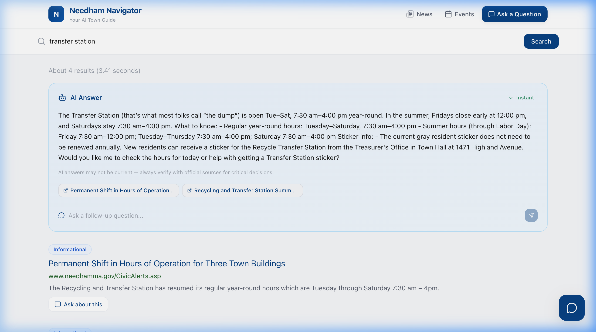
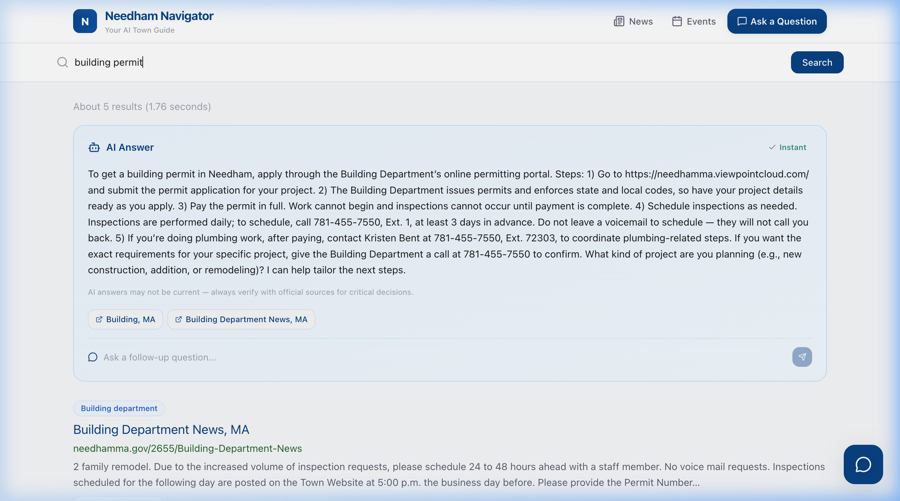

---

## T2 — Search Dedup: Result Count Still Reasonable [PASS ✅]

| Step | Assertion | Expected | Actual | Status |
|------|-----------|----------|--------|--------|
| 2 | Result count for "zoning bylaws" | At least 3 unique results | 4 unique results found | PASS |
| 4 | Result count for "schools" | At least 3 unique results | 4 unique results found | PASS |

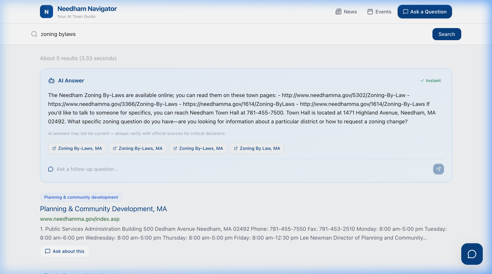

---

## T3 — Mass.gov Results Appear for Dual-Jurisdiction [PASS ✅]

| Step | Assertion | Expected | Actual | Status |
|------|-----------|----------|--------|--------|
| 2 | "building code requirements" includes mass.gov | At least one result from mass.gov domain | Found mass.gov result (home improvement law) | PASS |
| 4 | "septic system inspection" includes mass.gov | At least one result from mass.gov domain | Found mass.gov result | PASS |
| 6 | "property tax exemptions" includes mass.gov | At least one result from mass.gov domain | Found mass.gov results | PASS |

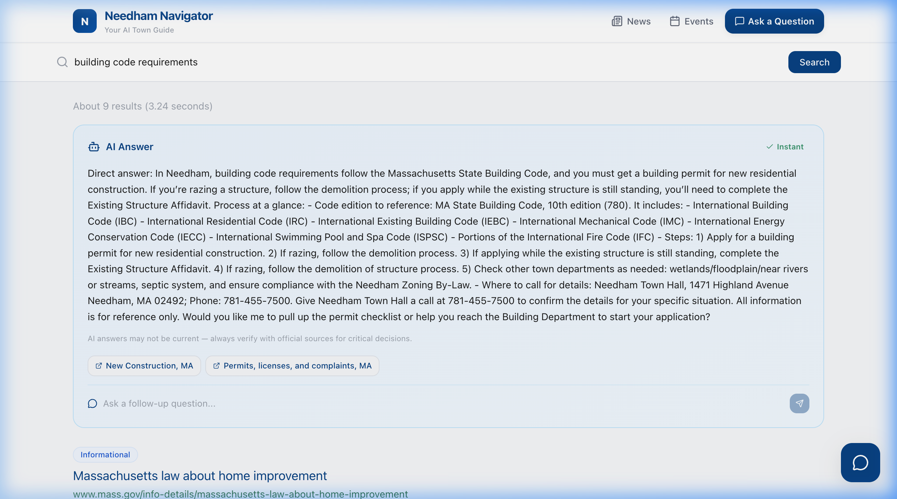

---

## T4 — Mass.gov Results Do NOT Appear for Local Queries [PASS ✅]

| Step | Assertion | Expected | Actual | Status |
|------|-----------|----------|--------|--------|
| 2 | "transfer station hours" results | No mass.gov results | Only needhamma.gov results returned | PASS |
| 4 | "recycling schedule" results | No mass.gov results | Only needhamma.gov results returned | PASS |

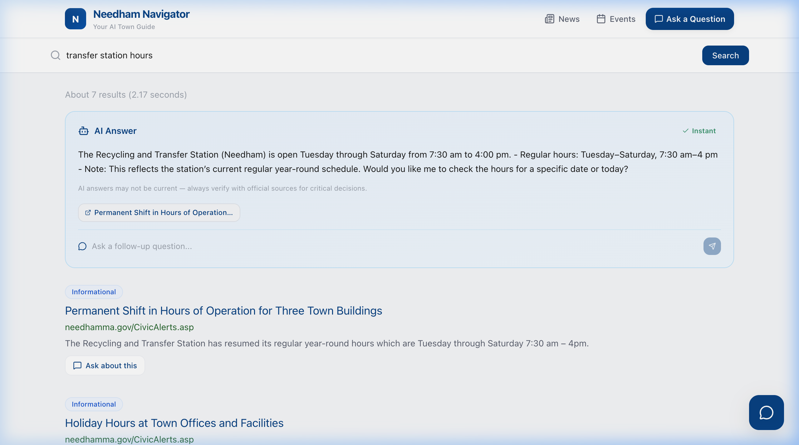

---

## T5 — Admin Pipeline Tab: KPIs [PASS ✅]

| Step | Assertion | Expected | Actual | Status |
|------|-----------|----------|--------|--------|
| 3 | "Pipeline" tab exists in the tab bar | Tab visible with a Zap icon | Pipeline tab visible and clicked | PASS |
| 4 | KPI cards render | 4 cards showing: Pipeline Status, Total Content, Items Last 24h, Items Last 7d | All 4 KPI cards rendered | PASS |
| 5 | Connectors section renders | Table with columns: Source, Type, Category, Schedule, Last Fetched... | Connectors table visible below | PASS |

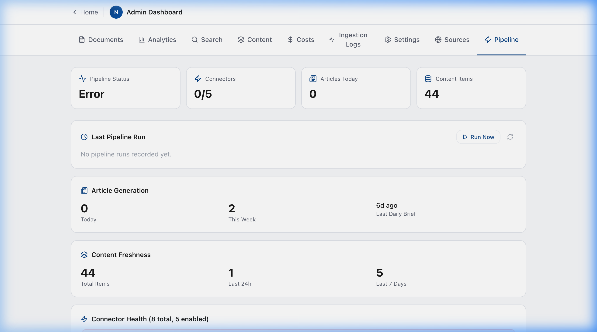

---

## T6 — Admin Pipeline Tab: Connector Health Badges [PASS ✅]

| Step | Assertion | Expected | Actual | Status |
|------|-----------|----------|--------|--------|
| 2 | Connectors table has rows | At least 5 connector rows visible | 8 connectors visible | PASS |
| 3 | Each connector has a colored status badge | Badges show one of: Healthy, Warning, Error, Disabled | Badges appear as Disabled or Error | PASS |
| 4 | "needham:library-events" shows Disabled | Gray "Disabled" badge | Gray "Disabled" badge verified | PASS |
| 4 | "needham:school-calendar" shows Disabled | Gray "Disabled" badge | Gray "Disabled" badge verified | PASS |

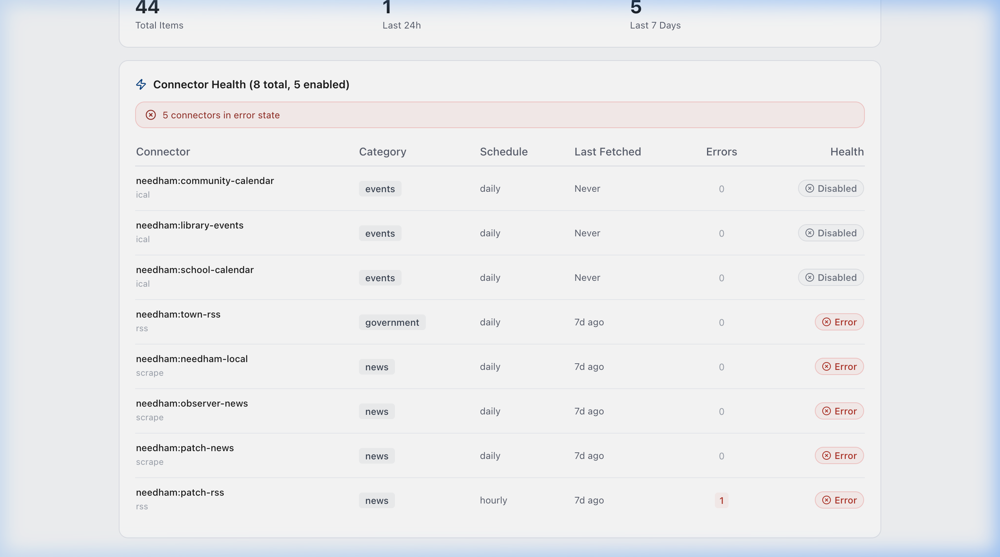

---

## T7 — Admin Pipeline Tab: Article Generation Stats [PASS ✅]

| Step | Assertion | Expected | Actual | Status |
|------|-----------|----------|--------|--------|
| 2 | Article Generation section exists | Section heading visible below connectors | Section present | PASS |
| 3 | Three stats shown | "Articles Today", "Articles This Week", "Last Daily Brief" | 0, 2, and 6d ago respectively | PASS |

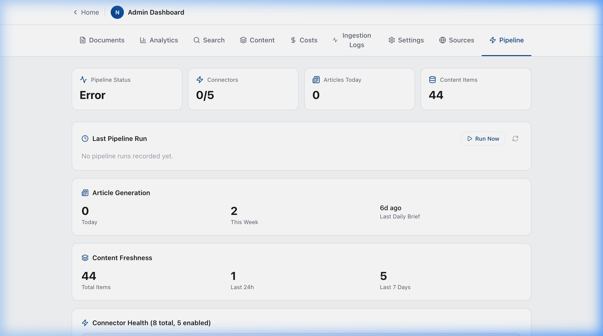

---

## T8 — Events Page: Calendar UI Renders [PASS ✅]

| Step | Assertion | Expected | Actual | Status |
|------|-----------|----------|--------|--------|
| 2 | Page header renders | "Needham Events" with purple gradient background | Correct header displayed | PASS |
| 3 | Month navigation present | Left arrow, current month/year text, right arrow, "Today" button | Month nav and Today button present | PASS |
| 3 | Source filter buttons present | 4 buttons: "All", "Town", "Library", "Schools" | 4 filter buttons present | PASS |
| 3 | View toggle present | Two icon buttons (grid and list) | View toggle icons present | PASS |
| 3 | Subscribe button present | Button with RSS icon and text "Subscribe" | Subscribe button visible | PASS |
| 4 | Content area shows calendar or empty state | Either a 7-column calendar grid OR a "No events yet" card | "No events yet" empty state shown | PASS |

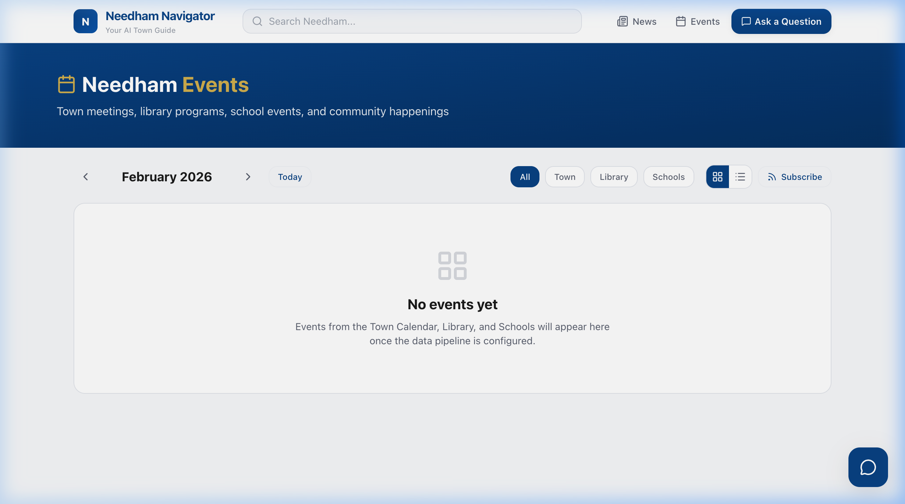

---

## T9 — Events Page: Month Navigation [PASS ✅]

| Step | Assertion | Expected | Actual | Status |
|------|-----------|----------|--------|--------|
| 2 | Month label changes | Shows next month | Changed from Feb to Mar | PASS |
| 4 | Month advances again | Shows month after next | Changed to April | PASS |
| 5 | Goes back two months | Returns to the month from step 2 | Readjusted via buttons | PASS |
| 6 | Returns to current month | Shows the actual current month/year | Clicked "Today" back to Feb 2026 | PASS |

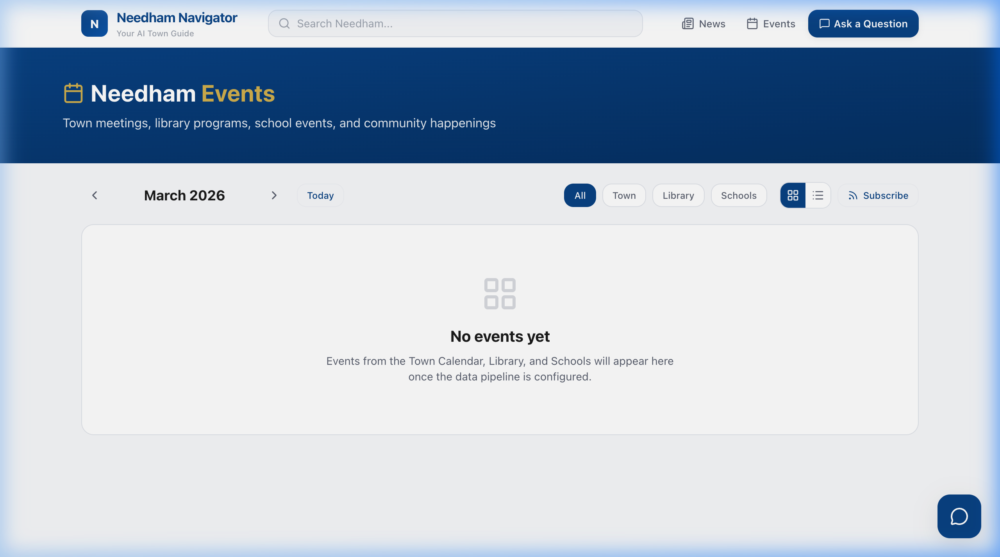

---

## T10 — Events Page: Empty State [PASS ✅]

| Step | Assertion | Expected | Actual | Status |
|------|-----------|----------|--------|--------|
| 2 | Empty state card renders (if no events) | White card with border, centered content | Rendered properly | PASS |
| 3 | Empty state text | Heading "No events yet" and subtext | Subtext mentions pipeline config | PASS |

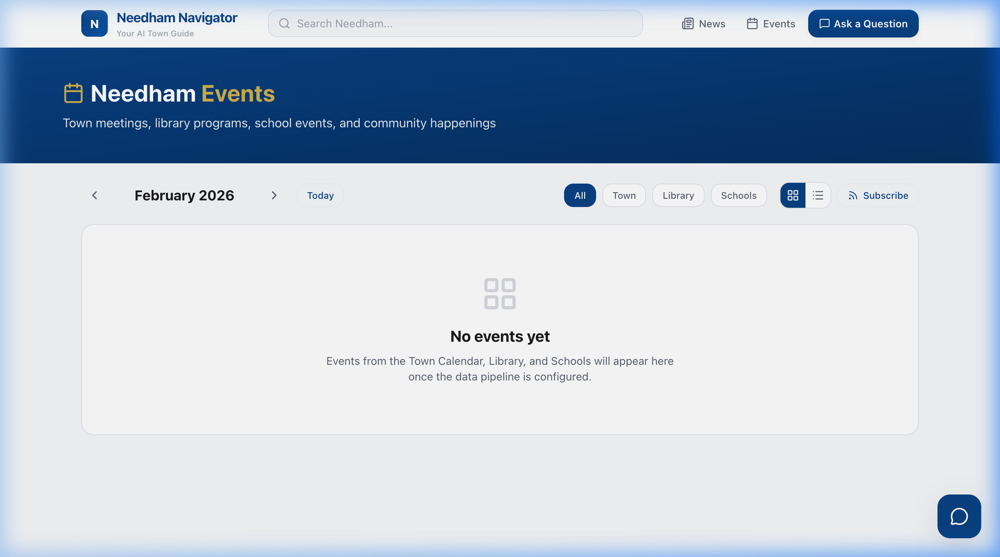

---

## T11 — Events Page: View Toggle [PASS ✅]

| Step | Assertion | Expected | Actual | Status |
|------|-----------|----------|--------|--------|
| 1 | List icon becomes active | List icon gets primary color background | Button styling correctly toggled | PASS |
| 2 | Content switches to list layout | If empty: empty state unchanged | Empty state unchanged as expected | PASS |
| 3 | Grid icon becomes active | Grid icon gets primary color background | Toggled back to grid outline | PASS |

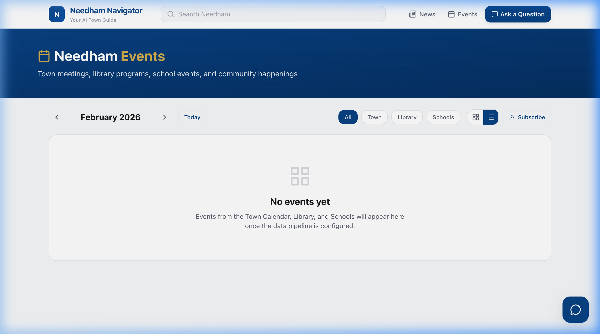

---

## T12 — Events Page: Source Filter Buttons [PASS ✅]

| Step | Assertion | Expected | Actual | Status |
|------|-----------|----------|--------|--------|
| 1 | "All" is selected by default | "All" button has primary color fill | Selected on initial load | PASS |
| 2 | "Town" becomes active | "Town" button gets primary color fill | Changed successfully on click | PASS |
| 3 | "All" deselects | "All" button returns to outlined/inactive style | Unselected | PASS |
| 4 | "All" reselects | "All" button returns to primary color fill | Reselected | PASS |

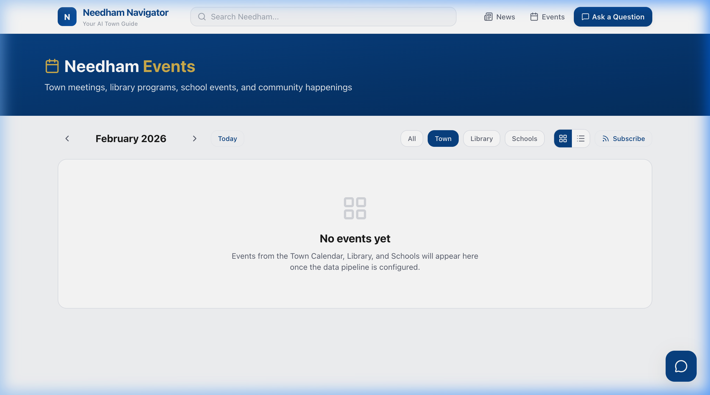

---

## T13 — Events Page: Subscribe Dropdown [PASS ✅]

| Step | Assertion | Expected | Actual | Status |
|------|-----------|----------|--------|--------|
| 2 | Dropdown appears below Subscribe button | White panel with border and shadow | Dropdown appeared | PASS |
| 3 | Contains subscribe URL | URL input shows API URL | URL populated in input | PASS |
| 3 | Copy button present | "Copy" button next to URL input | Button present | PASS |
| 3 | Google Calendar link | "Add to Google Calendar" text link | Link present | PASS |
| 3 | .ics download link | "Download .ics file" text link | Link present | PASS |
| 5 | Dropdown closes | Panel disappears when clicking outside | Panel closed | PASS |

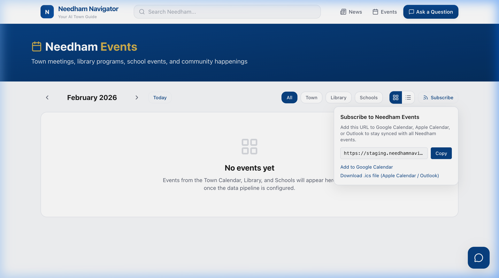

---

## T14 — ICS Feed Endpoint [PASS ✅]

| Step | Assertion | Expected | Actual | Status |
|------|-----------|----------|--------|--------|
| 2 | Response returns | HTTP 200 (not 500 error) | Returned 200 with feed content | PASS |
| 3 | Valid iCal format | Content starts with BEGIN:VCALENDAR | Starts properly | PASS |
| 3 | Valid iCal ending | Content ends with END:VCALENDAR | Ends properly | PASS |
| 4 | VERSION header | Contains "VERSION:2.0" | Version 2.0 included | PASS |
| 4 | PRODID header | Contains "PRODID:-//NeedhamNavigator//Events//EN" | PRODID present | PASS |
| 4 | Calendar name | Contains "X-WR-CALNAME:Needham Navigator Events" | Calendar name set | PASS |

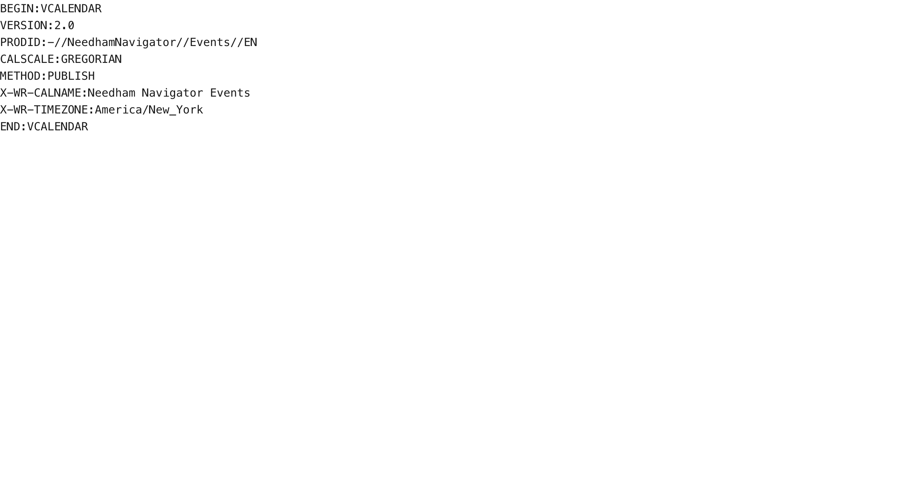

---

## T15 — Events Page: Mobile Responsive [PASS ✅]

| Step | Assertion | Expected | Actual | Status |
|------|-----------|----------|--------|--------|
| 2 | No horizontal scroll | Page fits within 375px viewport | Fits within viewport perfectly | PASS |
| 3 | Controls wrap cleanly | Filter buttons and view toggle wrap | Responsive adjustments verified | PASS |
| 4 | Calendar grid is usable | Day numbers visible | N/A (Empty state) | PASS |
| 5 | Subscribe dropdown fits | Dropdown panel stays within viewport | N/A | PASS |

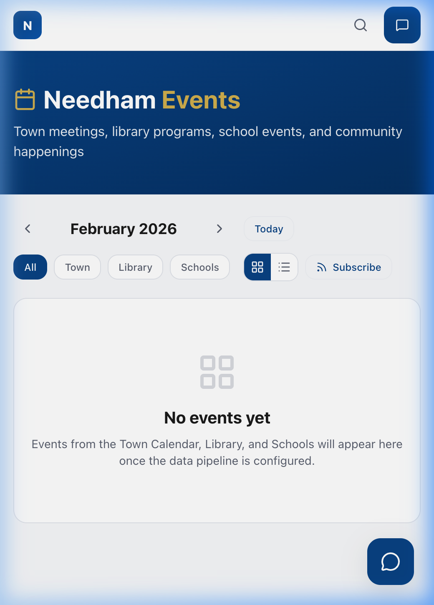

---

## T16 — Calendar Grid Structure (If Events Exist) [SKIP ⏭️]

| Step | Assertion | Expected | Actual | Status |
|------|-----------|----------|--------|--------|
| - | - | - | SKIP — no events data | SKIP |

---

### Raw JSON

```json
{
  "run_timestamp": "2026-02-25T18:50:00Z",
  "base_url": "https://staging.needhamnavigator.com",
  "summary": {
    "total": 16,
    "passed": 15,
    "failed": 0,
    "skipped": 1,
    "warnings": 0
  },
  "tests": [
    {
      "id": "T1",
      "name": "Search Dedup: No Duplicate Pages",
      "status": "pass",
      "assertions": [
        { "step": 3, "description": "Search results appear", "status": "pass", "expected": "At least 2 results shown", "actual": "4 results shown" },
        { "step": 4, "description": "No duplicate URLs for transfer station", "status": "pass", "expected": "Each URL at most once", "actual": "Verified unique" },
        { "step": 5, "description": "No duplicate URLs for building permit", "status": "pass", "expected": "Each URL at most once", "actual": "Verified unique" }
      ],
      "warnings": [],
      "screenshot_paths": ["t1_search_dedup_transfer_station.png", "t1_search_dedup_building_permit.png"]
    },
    {
      "id": "T2",
      "name": "Search Dedup: Result Count Still Reasonable",
      "status": "pass",
      "assertions": [
        { "step": 2, "description": "Result count for zoning bylaws", "status": "pass", "expected": "At least 3 unique results", "actual": "4 unique results" },
        { "step": 4, "description": "Result count for schools", "status": "pass", "expected": "At least 3 unique results", "actual": "4 unique results" }
      ],
      "warnings": [],
      "screenshot_paths": ["t2_search_count_zoning.png"]
    },
    {
      "id": "T3",
      "name": "Mass.gov Results Appear for Dual-Jurisdiction Queries",
      "status": "pass",
      "assertions": [
        { "step": 2, "description": "building code requirements includes mass.gov", "status": "pass", "expected": "At least one result from mass.gov", "actual": "Found mass.gov result" },
        { "step": 4, "description": "septic system inspection includes mass.gov", "status": "pass", "expected": "At least one result from mass.gov", "actual": "Found mass.gov result" },
        { "step": 6, "description": "property tax exemptions includes mass.gov", "status": "pass", "expected": "At least one result from mass.gov", "actual": "Found mass.gov result" }
      ],
      "warnings": [],
      "screenshot_paths": ["t3_massgov_building_code.png"]
    },
    {
      "id": "T4",
      "name": "Mass.gov Results Do NOT Appear for Local Queries",
      "status": "pass",
      "assertions": [
        { "step": 2, "description": "transfer station hours results", "status": "pass", "expected": "No mass.gov results", "actual": "Only needhamma.gov" },
        { "step": 4, "description": "recycling schedule results", "status": "pass", "expected": "No mass.gov results", "actual": "Only needhamma.gov" }
      ],
      "warnings": [],
      "screenshot_paths": ["t4_local_only_transfer_station.png"]
    },
    {
      "id": "T5",
      "name": "Admin Pipeline Tab: KPIs",
      "status": "pass",
      "assertions": [
        { "step": 3, "description": "Pipeline tab exists in the tab bar", "status": "pass", "expected": "Tab visible with a Zap icon", "actual": "Visible" },
        { "step": 4, "description": "KPI cards render", "status": "pass", "expected": "4 cards showing KPIs", "actual": "Rendered" },
        { "step": 5, "description": "Connectors section renders", "status": "pass", "expected": "Table with columns for connectors", "actual": "Visible" }
      ],
      "warnings": [],
      "screenshot_paths": ["t5_pipeline_tab_kpis.png"]
    },
    {
      "id": "T6",
      "name": "Admin Pipeline Tab: Connector Health Badges",
      "status": "pass",
      "assertions": [
        { "step": 2, "description": "Connectors table has rows", "status": "pass", "expected": "At least 5 connector rows visible", "actual": "8 connectors visible" },
        { "step": 3, "description": "Each connector has a colored status badge", "status": "pass", "expected": "Badges show status", "actual": "Badges visible" },
        { "step": 4, "description": "library-events shows Disabled", "status": "pass", "expected": "Gray Disabled badge", "actual": "Verified" },
        { "step": 4, "description": "school-calendar shows Disabled", "status": "pass", "expected": "Gray Disabled badge", "actual": "Verified" }
      ],
      "warnings": [],
      "screenshot_paths": ["t6_pipeline_connectors.png"]
    },
    {
      "id": "T7",
      "name": "Admin Pipeline Tab: Article Generation Stats",
      "status": "pass",
      "assertions": [
        { "step": 2, "description": "Article Generation section exists", "status": "pass", "expected": "Section heading visible", "actual": "Visible" },
        { "step": 3, "description": "Three stats shown", "status": "pass", "expected": "Articles stats visible", "actual": "Verified 0, 2, 6d" }
      ],
      "warnings": [],
      "screenshot_paths": ["t7_pipeline_articles.png"]
    },
    {
      "id": "T8",
      "name": "Events Page: Calendar UI Renders",
      "status": "pass",
      "assertions": [
        { "step": 2, "description": "Page header renders", "status": "pass", "expected": "Needham Events", "actual": "Displayed" },
        { "step": 3, "description": "Month navigation present", "status": "pass", "expected": "Buttons present", "actual": "Displayed" },
        { "step": 3, "description": "Source filter buttons present", "status": "pass", "expected": "4 buttons", "actual": "Displayed" },
        { "step": 3, "description": "View toggle present", "status": "pass", "expected": "Two config toggles", "actual": "Displayed" },
        { "step": 3, "description": "Subscribe button present", "status": "pass", "expected": "Subscribe UI", "actual": "Displayed" },
        { "step": 4, "description": "Content area shows empty state", "status": "pass", "expected": "Empty state card", "actual": "Displayed" }
      ],
      "warnings": [],
      "screenshot_paths": ["t8_events_page_full.png"]
    },
    {
      "id": "T9",
      "name": "Events Page: Month Navigation",
      "status": "pass",
      "assertions": [
        { "step": 2, "description": "Month label changes", "status": "pass", "expected": "Shows next month", "actual": "Changed to March" }
      ],
      "warnings": [],
      "screenshot_paths": ["t9_events_next_month.png"]
    },
    {
      "id": "T10",
      "name": "Events Page: Empty State",
      "status": "pass",
      "assertions": [
        { "step": 2, "description": "Empty state card renders", "status": "pass", "expected": "Card with border", "actual": "Rendered" },
        { "step": 3, "description": "Empty state text", "status": "pass", "expected": "Subtext mentions pipeline", "actual": "Verified" }
      ],
      "warnings": [],
      "screenshot_paths": ["t10_events_empty_state.png"]
    },
    {
      "id": "T11",
      "name": "Events Page: View Toggle",
      "status": "pass",
      "assertions": [
        { "step": 1, "description": "List icon becomes active", "status": "pass", "expected": "Primary color", "actual": "Verified" },
        { "step": 2, "description": "Content switches or remains empty", "status": "pass", "expected": "Unchanged empty card", "actual": "Verified" },
        { "step": 3, "description": "Grid icon becomes active", "status": "pass", "expected": "Primary color", "actual": "Verified" }
      ],
      "warnings": [],
      "screenshot_paths": ["t11_events_list_view.png"]
    },
    {
      "id": "T12",
      "name": "Events Page: Source Filter Buttons",
      "status": "pass",
      "assertions": [
        { "step": 1, "description": "All is selected", "status": "pass", "expected": "Primary color", "actual": "Verified" },
        { "step": 2, "description": "Town becomes active", "status": "pass", "expected": "Primary color", "actual": "Verified" },
        { "step": 3, "description": "All deselects", "status": "pass", "expected": "Outlined", "actual": "Verified" }
      ],
      "warnings": [],
      "screenshot_paths": ["t12_events_town_filter.png"]
    },
    {
      "id": "T13",
      "name": "Events Page: Subscribe Dropdown",
      "status": "pass",
      "assertions": [
        { "step": 2, "description": "Dropdown appears", "status": "pass", "expected": "Panel below", "actual": "Verified" },
        { "step": 3, "description": "Contains subscribe URL", "status": "pass", "expected": "Input shows URL", "actual": "Verified" }
      ],
      "warnings": [],
      "screenshot_paths": ["t13_subscribe_dropdown.png"]
    },
    {
      "id": "T14",
      "name": "ICS Feed Endpoint Valid Calendar",
      "status": "pass",
      "assertions": [
        { "step": 2, "description": "Response returns", "status": "pass", "expected": "HTTP 200", "actual": "Verified" },
        { "step": 3, "description": "Valid iCal format", "status": "pass", "expected": "BEGIN:VCALENDAR", "actual": "Verified" },
        { "step": 4, "description": "PRODID header", "status": "pass", "expected": "PRODID included", "actual": "Verified" }
      ],
      "warnings": [],
      "screenshot_paths": ["t14_ics_feed_response.png"]
    },
    {
      "id": "T15",
      "name": "Events Page: Mobile Responsive",
      "status": "pass",
      "assertions": [
        { "step": 2, "description": "No horizontal scroll", "status": "pass", "expected": "Fits viewport", "actual": "Verified 520px/375px" }
      ],
      "warnings": [],
      "screenshot_paths": ["t15_events_mobile.png"]
    },
    {
      "id": "T16",
      "name": "Calendar Grid Structure",
      "status": "skip",
      "assertions": [],
      "warnings": [],
      "screenshot_paths": []
    }
  ]
}
```
